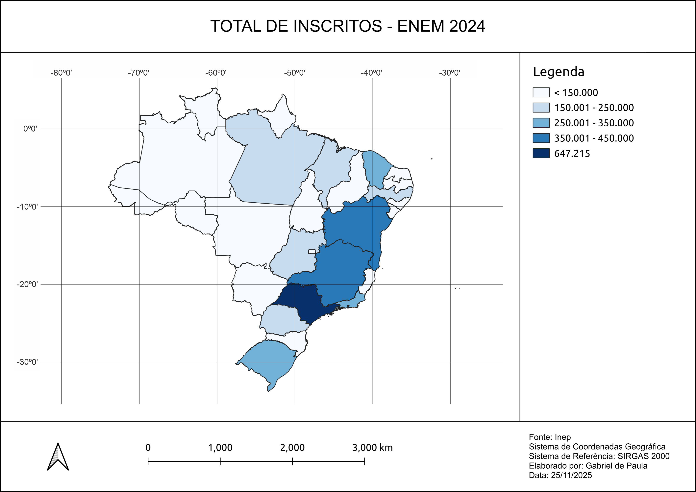
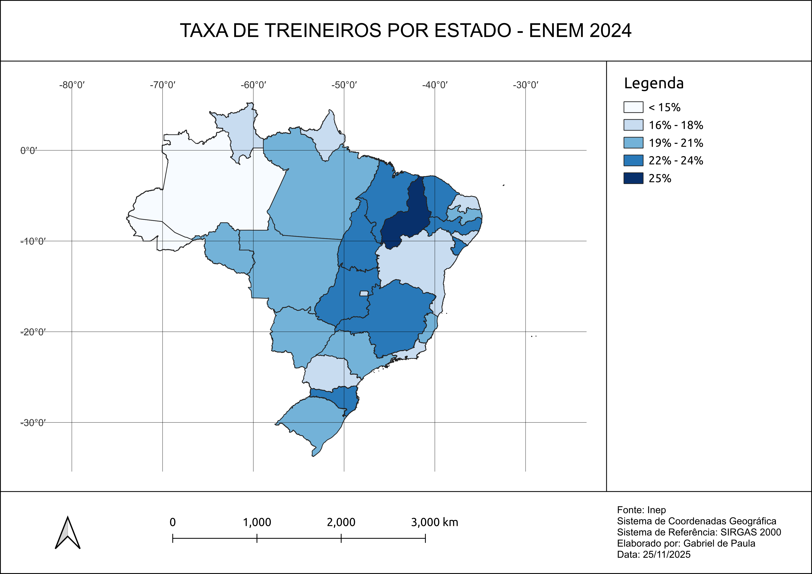
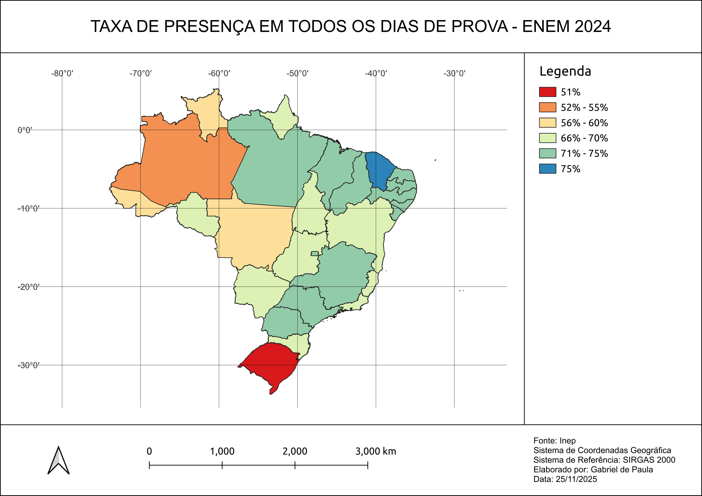
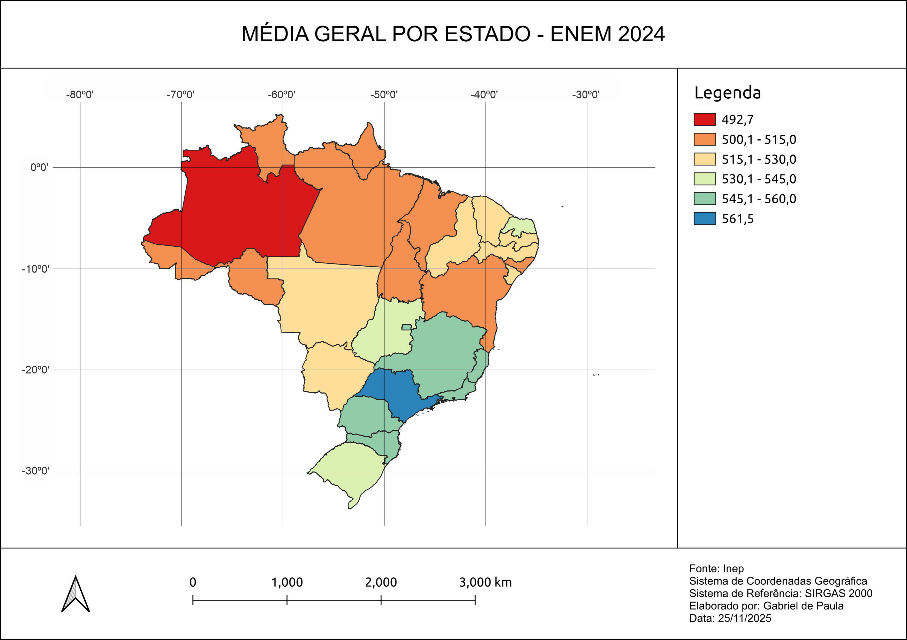

# Mapas Enem 2024

```py
DISCIPLINA = 'Cartografia Temática'
ESTUDANTE = 'Gabriel de Paula'
PROFESSOR = 'Silvia Ventorini'
SEMESTRE = '2025.2'
```

&nbsp;

## 📊 Dados

**Enem** - Exame Nacional do Ensino Médio\
**Inep** - Instituto Nacional de Estudos e Pesquisas Educacionais Anísio Teixeira

> Os microdados do Enem são o menor nível de desagregação de dados recolhidos por meio do exame. Eles atendem a demanda por informações específicas ao disponibilizar as provas, os gabaritos, as informações sobre os itens, as notas e o questionário respondido pelos inscritos no Enem.

Foram usados dados das provas de 2024, com uma etapa de pré-processamento ([ver código Python](./main.ipynb)) para formular os mapas.

&nbsp;

## 🗺️ Mapas

### Total de inscritos



### Taxa de treineiros



### Taxa de presença



### Média geral


